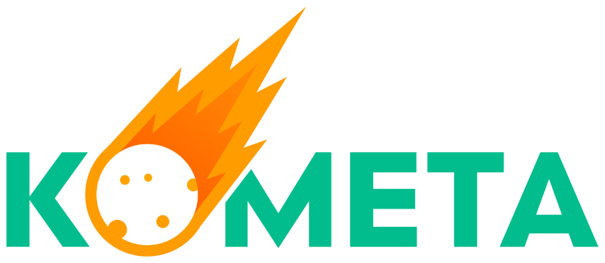

Welcome to the Kometa Quickstart Wizard. Here are some steps to getting started.

After having cloned the repo and assuming you are on Windows and you have a folder on your machine called `pyprogs` where you cloned Quickstart, open a powershell prompt into the `pyprogs` folder and then:

```
cd Quickstart
python -m venv venv
.\venv\scripts\activate.ps1
python -m pip install --upgrade pip
pip install -r .\requirements.txt
```
Now you are ready to run it (with the venv activated)

`python app.py`

Or how to call it to run from the venv if you have closed the powershell prompt. Navigating to `pyprogs\Quickstart`

`.\venv\scripts\python app.py`

Note: Updates can then be performed pretty easily by opening up your Windows powershell prompt into the `pyprogs` directory and performing the following commands:
```
cd Quickstart
git checkout main
git stash
git stash clear
git pull
.\venv\scripts\activate.ps1
python -m pip install --upgrade pip
pip install -r .\requirements.txt
```
